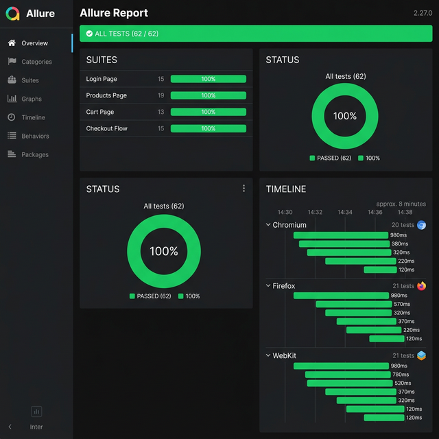

# 🧪 SauceDemo Playwright Test Automation

[](https://github.com/<your-username>/saucedemo-playwright/actions/workflows/playwright.yml)

End-to-end test automation for [SauceDemo](https://www.saucedemo.com) — a fake e-commerce site built for automation practice — using **Playwright** with **TypeScript**, the **Page Object Model** pattern, and **Allure** reporting.

---

## 📊 Allure Report



---

## 🛠 Tech Stack

| Tool | Purpose |
|------|---------|
| [Playwright](https://playwright.dev) | Browser automation & test runner |
| TypeScript | Type-safe test code |
| Page Object Model | Maintainable, reusable page abstractions |
| [Allure](https://allurereport.org) | Rich HTML test reports |
| GitHub Actions | CI/CD pipeline |

---

## 📁 Project Structure

```
saucedemo-playwright/
├── tests/
│   ├── login.spec.ts          # 15 login tests
│   ├── products.spec.ts       # 19 products page tests
│   ├── cart.spec.ts            # 13 cart tests
│   └── checkout.spec.ts       # 15 checkout flow tests
├── pages/
│   ├── LoginPage.ts            # Login page object
│   ├── ProductsPage.ts        # Products/inventory page object
│   ├── CartPage.ts             # Cart page object
│   └── CheckoutPage.ts        # Checkout page object (all 3 steps)
├── utils/
│   └── testData.ts             # Centralized test data & constants
├── .github/
│   └── workflows/
│       └── playwright.yml      # CI pipeline
├── playwright.config.ts        # Playwright configuration
├── package.json
└── README.md
```

---

## 🚀 Getting Started

### Prerequisites

- [Node.js](https://nodejs.org) v18 or later
- npm

### Installation

```bash
# Clone the repository
git clone https://github.com/<your-username>/saucedemo-playwright.git
cd saucedemo-playwright

# Install dependencies
npm install

# Install Playwright browsers
npx playwright install --with-deps
```

### Running Tests

```bash
# Run all tests across Chromium, Firefox, and WebKit
npm test

# Run tests in a specific browser
npm run test:chromium
npm run test:firefox
npm run test:webkit

# Run tests in headed mode (see the browser)
npm run test:headed

# Run a specific test file
npx playwright test tests/login.spec.ts

# Run with Playwright UI mode
npx playwright test --ui
```

### Generating Allure Reports

```bash
# Generate and open the Allure report
npm run allure:report

# Or generate only
npm run allure:generate

# Then open separately
npm run allure:open
```

---

## ✅ Test Coverage

| Test Suite | Tests | Coverage |
|-----------|-------|----------|
| **Login** | 15 | Valid/invalid login, error messages, UI elements |
| **Products** | 19 | Display, sorting (4 options), add/remove cart, navigation |
| **Cart** | 13 | Add/remove items, prices, persistence, navigation |
| **Checkout** | 15 | E2E flow, form validation, overview totals, confirmation |
| **Total** | **62** | |

---

## ⚙️ Configuration

Key settings in `playwright.config.ts`:

| Setting | Value |
|---------|-------|
| Base URL | `https://www.saucedemo.com` |
| Retries | 1 (local) / 2 (CI) |
| Screenshots | On failure only |
| Video | Retained on failure |
| Trace | Retained on failure |
| Timeout | 30 seconds |
| Action Timeout | 10 seconds |
| Browsers | Chromium, Firefox, WebKit |

---

## 🔄 CI/CD

Tests run automatically via GitHub Actions on every:
- **Push** to `main`
- **Pull request** to `main`

The pipeline:
1. Checks out code
2. Installs Node.js 18 + dependencies
3. Installs Playwright browsers
4. Runs all tests
5. Generates & uploads Allure report as artifact

---

## 📝 License

ISC
